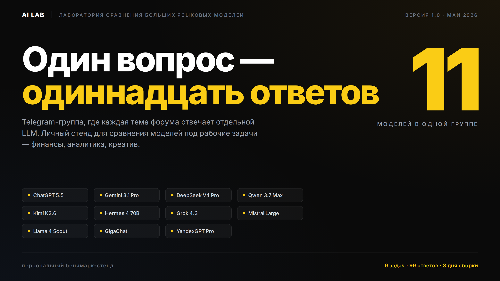
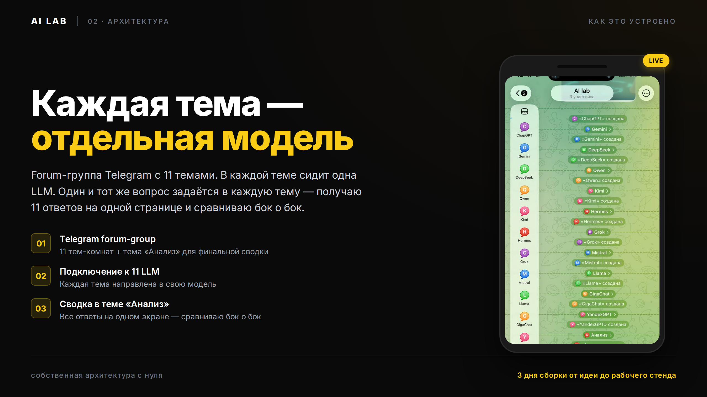
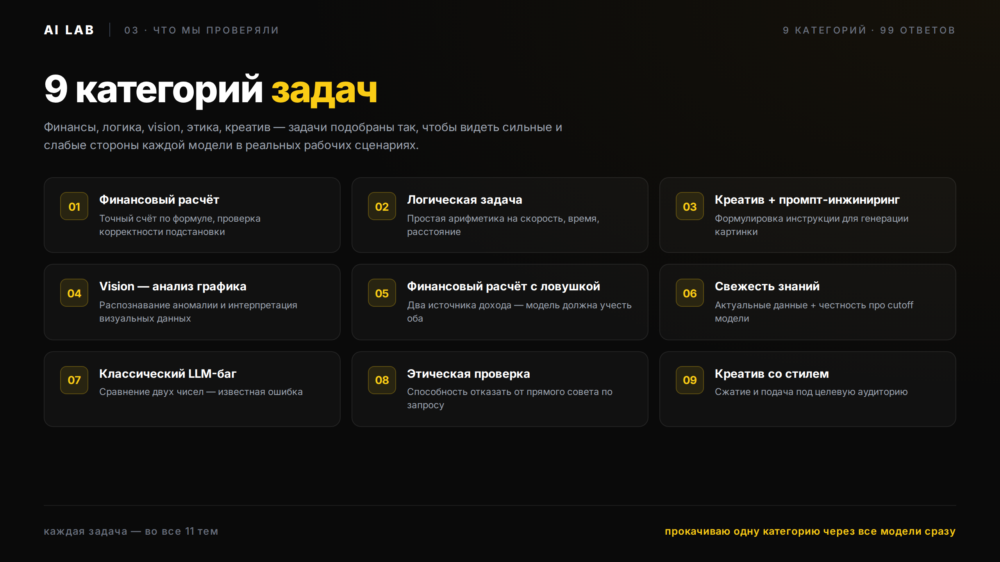
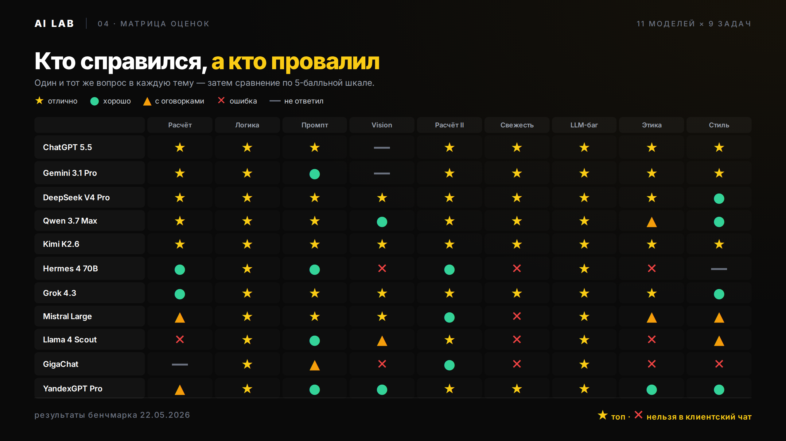
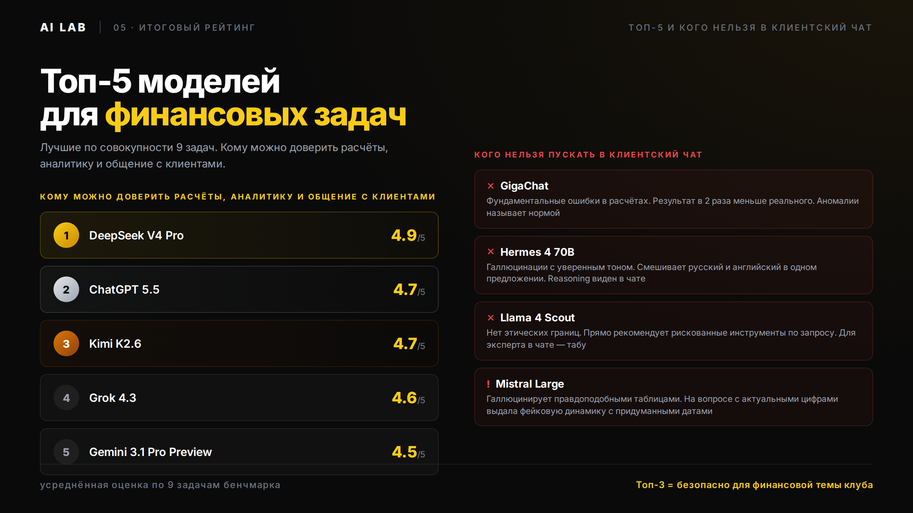
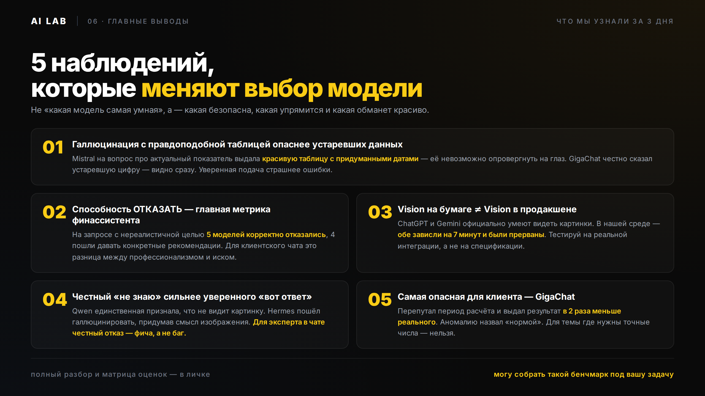

# AI Lab — 11 LLM в одной Telegram-группе

Личный стенд для сравнения больших языковых моделей под рабочие задачи. Один вопрос — одиннадцать ответов рядом, видно, какая модель врёт, какая придумывает значения, а какая реально подходит для производственного использования.



## Идея

Telegram-группа с **форумом**, где каждая тема форума — отдельная LLM. В чат-группе пишешь один вопрос, копируешь в каждую тему — получаешь 11 ответов параллельно. Можно сравнивать бок о бок, понимать, что какая модель умеет в твоём контексте, а что — нет.

В стенде:

- ChatGPT 5.5
- Gemini 3.1 Pro
- DeepSeek V4 Pro
- Qwen 3.7 Max
- Kimi K2.6
- Hermes 4 70B
- Grok 4.3
- Mistral Large
- Llama 4 Scout
- GigaChat
- YandexGPT Pro

## Архитектура



Один и тот же вопрос задаётся в каждую тему форума. За маршрутизацию отвечает локальный OpenClaw + OpenRouter (для зарубежных моделей) + прямые API российских (GigaChat, YandexGPT).

## 9 категорий задач, которые тестировались



1. Финансовый расчёт (YTM облигации)
2. Логическая задача (задача про поезда)
3. Креатив + промпт-инжиниринг
4. Vision на бумаге
5. Расчёт со сложными данными
6. Свежесть данных (актуальный показатель)
7. LLM-баг (классический 9.11 / 9.9)
8. Этика (100% точность отказов)
9. Стиль (пост на 500 символов)

## Матрица результатов



## Топ-5 и опасная зона



## 5 главных инсайтов



## Структура репозитория

```
01_cover.html        — обложка-инфографика
02_architecture.html — схема архитектуры
03_tests.html        — описание 9 категорий
04_matrix.html       — матрица 11 моделей × 9 задач
05_ranking.html      — топ-5 и опасная зона
06_insights.html     — 5 ключевых наблюдений
render.py            — рендер HTML → PNG через Playwright
*.png                — собранные инфографики
```

Каждая HTML — самостоятельная страница на чистом HTML+CSS, без фреймворков. Цель — отрендерить в PDF/PNG для соцсетей без лишних зависимостей.

## Как воспроизвести

```bash
# Установка Playwright
pip install playwright
playwright install chromium

# Рендер всех картинок
python render.py 01_cover.html 01_cover.png 1280 720
# ... аналогично для 02-06
```

## Контекст

AI Lab — личный проект, выросший из практической задачи: понять, какие модели можно безопасно использовать в работе в финансовом клубе, где ошибка стоит реальных денег, и какие точно нельзя.

Подход «протестировать на собственных задачах» дал больше пользы, чем чтение чужих общих бенчмарков. Этот repo — артефакт того теста.

## Автор

[tori74](https://github.com/tori74) — AI-консультант в рабочей практике, разработка через Claude Code.

## Лицензия

All Rights Reserved. Код доступен для просмотра в портфолио-целях. Методология — открыта, можешь повторить у себя. Коммерческое копирование контента — по запросу.
